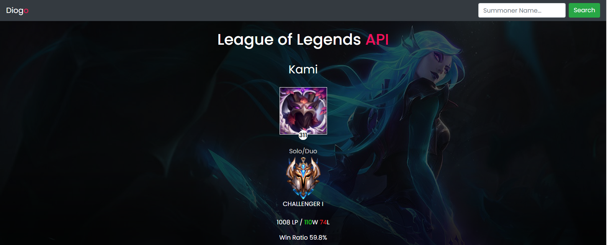
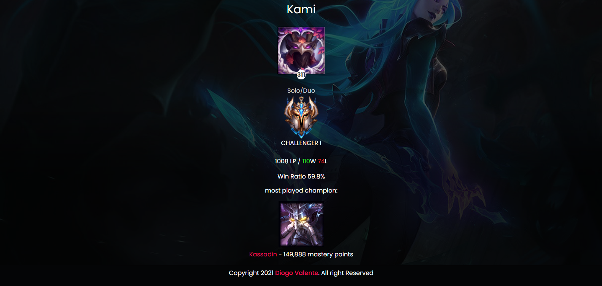
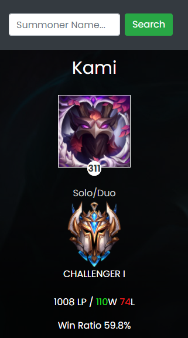
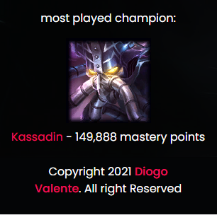

<h1 align="center">
  League of Legends API
</h1>

## 💻 Running the server

💡 Run the server on the command line just typing the following command:

<code>php -S localhost:8000</code>

After That, it will show at the terminal something like that:

<code>[Thu Feb 28 18:54:51 2021] PHP 7.4.3 Development Server (http://localhost:8000) started</code>

Now you can click on the link and you will see the application running!

## 📌
When you open the web page it will show as default the player "kami", a former professional player from Brazil. To change the player, just type the summoner name in the search field at the top of the page.

## 📸 The Project

 

Now we can see the most played champion

 

Responsive: 

## Notes

<pre><strong>Note 1</strong>
This application is just for fun and to pratice PHP. Maybe soon i will update the html/css to have a more pleasant look. 
<strong>Note 2</strong>
for now, only the BR (Brazilian) server has been implemented. Soon I will implement the other servers. 
<strong>Note 3</strong>
Maybe in the future i will implement a match history and some other things 
</pre>
