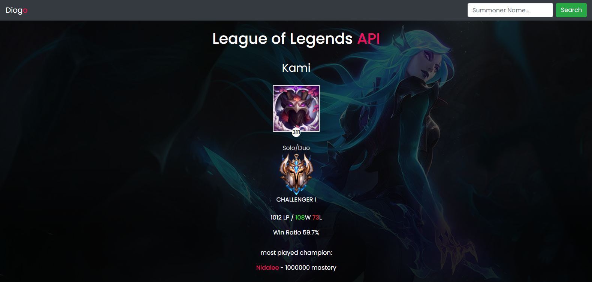

<h1 align="center">
  League of Legends API
</h1>

## Running the server

💡 Run the server on the command line just typing the following command:

<code>php -S localhost:8000</code>

After That, it will show at the terminal something like that:

<code>[Thu Feb 28 18:54:51 2021] PHP 7.4.3 Development Server (http://localhost:8000) started</code>

Now you can click on the link and you will see the application running!

## 📸 The Project

 
Responsive: 

## Notes

<pre><strong>Note 1</strong>
This application is just for fun and to study PHP using API 
<strong>Note 2</strong>
for now, only the BR (Brazilian) server has been implemented. Soon I will implement the other servers. 
<strong>Note 3</strong>
champion mastery will be implemented soon
 </pre>

